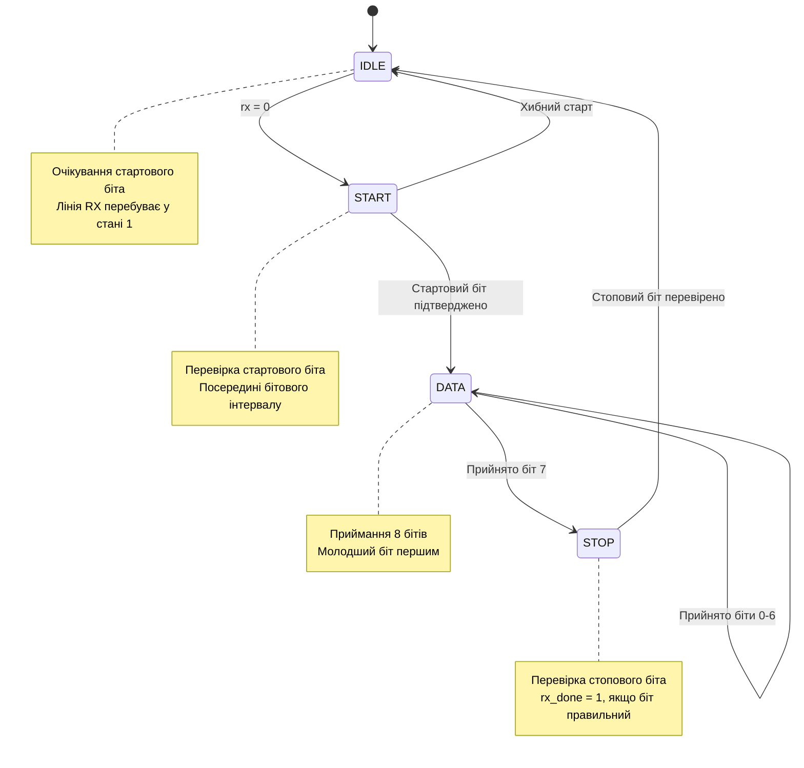

```mermaid
stateDiagram-v2
    [*] --> IDLE

    IDLE --> START: rx = 0
    START --> DATA: Стартовий біт підтверджено
    START --> IDLE: Хибний старт
    DATA --> DATA: Прийнято біти 0-6
    DATA --> STOP: Прийнято біт 7
    STOP --> IDLE: Стоповий біт перевірено

    note right of IDLE
        Очікування стартового біта
        Лінія RX перебуває у стані 1
    end note

    note right of START
        Перевірка стартового біта
        Посередині бітового інтервалу
    end note

    note right of DATA
        Приймання 8 бітів
        Молодший біт першим
    end note

    note right of STOP
        Перевірка стопового біта
        rx_done = 1, якщо біт правильний
    end note
```
