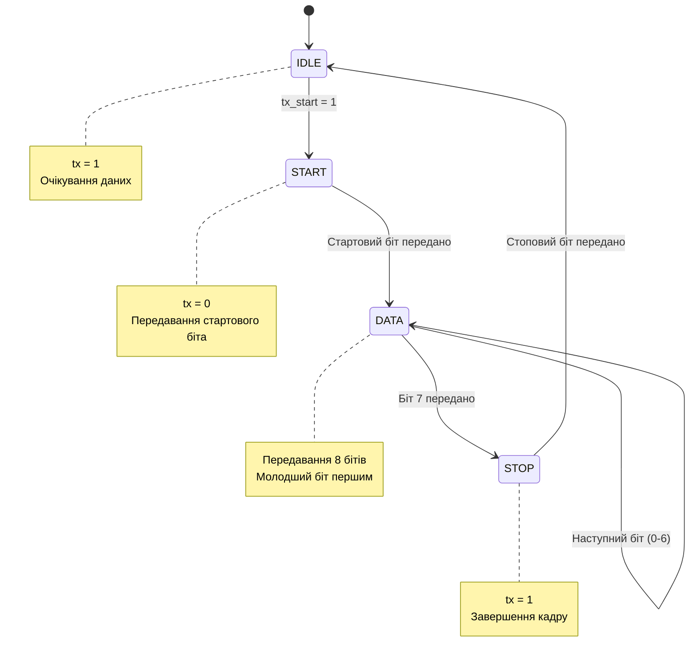

```mermaid
stateDiagram-v2
    [*] --> IDLE

    IDLE --> START: tx_start = 1
    START --> DATA: Стартовий біт передано
    DATA --> DATA: Наступний біт (0-6)
    DATA --> STOP: Біт 7 передано
    STOP --> IDLE: Стоповий біт передано

    note right of IDLE
        tx = 1
        Очікування даних
    end note

    note right of START
        tx = 0
        Передавання стартового біта
    end note

    note right of DATA
        Передавання 8 бітів
        Молодший біт першим
    end note

    note right of STOP
        tx = 1
        Завершення кадру
    end note
```
